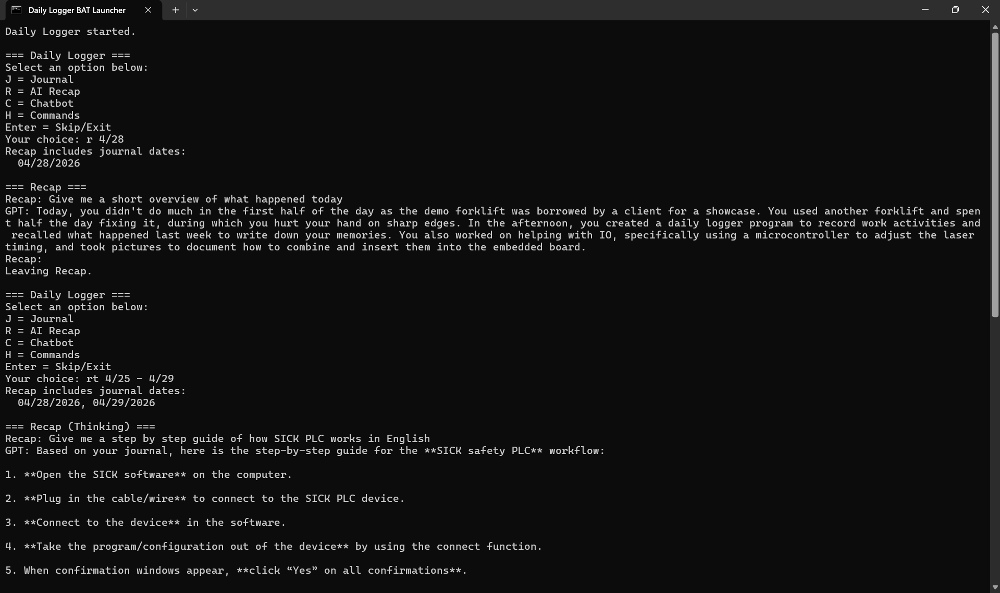

# Daily Logger

A Windows-first personal logging app that combines a fast terminal workflow with a modern Journal Window UI, Excel-backed storage, and optional AI-powered recap/chat features.

## Overview

Daily Logger helps you quickly capture daily notes and review them later.

- Terminal command interface for fast entry and control
- Journal Window UI with light/dark theme switching
- Excel-based storage (`daily_logs/Journal.xlsx`)
- Optional speech-to-text and AI report generation
- Recap and chatbot modes powered by OpenAI API

---

## Download EXE

If you just want to run the app on Windows, use the packaged executable:

- [Download DailyLogger.exe](https://github.com/Snowey1110/daily-logger/releases/download/v1.0.0/DailyLogger.exe)

> If your browser warns about downloading an `.exe`, confirm that the file comes from your trusted project source.

---

## Screenshots

### Terminal Interface


### Journal Window - Dark Theme


### Journal Window - Light Theme


---

## Project Structure

- `daily_logger.py` - main application logic
- `launch_daily_logger.bat` - Windows launcher
- `dist/DailyLogger.exe` - packaged executable build
- `daily_logs/` - generated journal Excel data
- `settings/` - local preferences and API key files
- `images/` - README screenshots

---

## Quick Start (EXE)

1. Download `DailyLogger.exe` from the link above.
2. Run the executable.
3. On first launch:
   - choose your app name (or press Enter for `Daily Logger`)
   - choose whether to auto-start with Windows

No Python installation is required when using the EXE.

---

## Quick Start (Python)

### 1) Prerequisites

- Python 3.10+ recommended
- Windows Command Prompt or PowerShell

### 2) Run the app

```bash
python daily_logger.py
```

Or double-click:

```text
launch_daily_logger.bat
```

### 3) Dependency installation prompt

At startup, Daily Logger checks for required and optional packages and shows a single combined install prompt.

- Required packages are needed for app startup.
- Optional packages enable full Journal Window features such as speech-to-text recording and calendar popup.

---

## Core Commands

From the main menu:

- `J` - Journal
- `R` - Recap (journal-context AI)
- `RT` - Recap using thinking model
- `C` - Chatbot (general AI chat)
- `CT` - Chatbot using thinking model
- `H` or `HELP` - command help
- `RESTORE` - reopen latest unsaved Journal Window draft
- `STARTUP TRUE` / `STARTUP FALSE` - manage Windows startup behavior
- `DEFAULT WINDOWS` / `DEFAULT CONSOLE` - set preferred journal input mode
- `SB bat` / `SB journal` - create Start Menu shortcuts
- `RENAME` or `RENAME <name>` - rename the app title

---

## Data and Storage

### Journal File

- Path: `daily_logs/Journal.xlsx`
- Sheets:
  - `Master Journal` (always first)
  - date sheets (for example `2026-04-28`)

### Sync Behavior

- New entries are saved to that day sheet.
- `Master Journal` is rebuilt from date sheets.
- Deleting a date sheet removes those entries from `Master Journal` on next rebuild.
- Date sheets are ordered newest to oldest behind `Master Journal`.

### Draft Backup

- Journal Window draft file: `settings/journal_window_draft.json`
- Automatically updated while editing
- Reopen with `RESTORE`

---

## OpenAI Features

OpenAI features include Recap/Chatbot modes, AI report generation, and transcription support.

You can add your token at any time from the app command line:

- `TOKEN ADD [OPENAI API TOKEN]`

On first AI use, the app can also prompt for an API key and stores it locally in:

- `settings/daily_logger_api_key.txt`

Optional environment override:

- `OPENAI_API_KEY`

No token is required to use non-AI features (for example journaling, Excel logging, theme switching, startup controls, and other local app functions).

---

## Startup Behavior

You can enable launch-at-login from inside the app:

- `STARTUP TRUE` to enable
- `STARTUP FALSE` to disable

This manages a shortcut in the Windows Startup folder.

---

## Notes

- This project is Windows-focused.
- Settings and generated data are local and not intended for source control.
- The journal flow supports fast terminal input and a richer window editor workflow.
